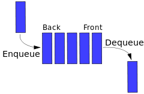

# 4 データ構造

- [スタック](#4-2-スタック)

## 4-2 スタック

---

### 概要

- 後入れ先出し（LIFO: Last In First Out） の規則に従いデータを管理
- 一時的にデータを退避したいてきに有効なデータ構造
- **O(1)の計算量**
    pop、push とともにスタックポインタの加算・減算などを考慮

---

### 主な変数/関数

| 変数    |                                                                                   |
| ------- | --------------------------------------------------------------------------------- |
| S[ ]    | push されたデータを格納する整数型 1 次元配列                                      |
| top     | スタックの頂点の要素を指し示す整数型変数  最後の要素が格納されている場所を指す |
| push(x) | top を一つ増やし S[top] に x を代入                                               |
| pop()   | S[top] の値を返し、top を１つ減らす                                               |

## 4-3 キュー

---

### 概要

- 先入れ先出し（FIFO: First In First Out）の規則に従いデータを管理
- データを到着順に処理したいときに使用するデータ構造
- リングバッファを用いれば**O(1)の計算量**

---

### 主な変数/関数

| 変数       |                                                                                            |
| ---------- | ------------------------------------------------------------------------------------------ |
| Q[ ]       | Q の各要素に enqueue されたデータを格納                                                    |
| head       | キューの先頭の場所を指し示す変数 dequeue されると head で指されている要素が取り出される |
| tail       | キューの末尾 + 1 の場所を指し示す変数 tail は新しい要素が追加される場所を示す           |
| enqueue(x) | Q[tail]に x を代入し、tail を１つ増やす                                                    |
| dequeue()  | Q[head]の値を返し、head を１つ増やす                                                       |
